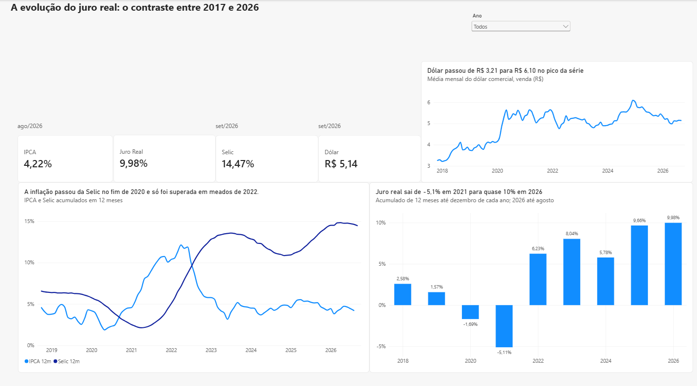

Monitor de Indicadores Econômicos

Pipeline de coleta, análise e monitoramento de indicadores econômicos brasileiros (IPCA, Selic e dólar): coleta automatizada em Python, armazenamento e cálculos em SQL Server, dashboard em Power BI e alerta por e-mail com Power Automate.

Este é o segundo projeto do meu portfólio de transição para a área de Análise de Dados. O primeiro, Despesas Públicas Federais, foca em SQL e Power BI; este acrescenta Python, consumo de APIs e automação.

Período coberto: nov/2017 a set/2026 · séries mensais.

Objetivo

Acompanhar a relação entre inflação, juros e câmbio e responder:

Qual a inflação acumulada em 12 meses (IPCA 12m) e como ela evoluiu?
Qual o juro real (Selic descontada da inflação) ao longo do tempo?
Como o dólar se comportou no período?
A inflação está dentro do teto da meta? (verificado automaticamente a cada execução)
Habilidades demonstradas
Área	O que foi aplicado
Python	Consumo de API com requests, novas tentativas automáticas em caso de instabilidade, tratamento com pandas, gravação no SQL Server com SQLAlchemy + pyodbc
SQL	Pivotamento com MAX(CASE WHEN ...), funções de janela (OVER, ROWS BETWEEN), acumulado de taxas com EXP(SUM(LOG(...))), CTE, views
Power BI + DAX	Tabela calendário em Linguagem M, medidas de "último valor disponível", cartões com mês de referência dinâmico
Power Automate	Fluxo que executa a coleta, verifica falhas pelo código de saída, consulta o banco e envia e-mail de alerta
Qualidade de dados	Exclusão do mês em andamento, acumulados só com 12 meses completos, validação contra a fonte original
Resolução de problemas	Migração da fonte de dados quando a API original ficou indisponível
Fonte dos dados

Os dados vêm da API do Ipeadata (Instituto de Pesquisa Econômica Aplicada), que republica as séries oficiais:

Indicador	Código Ipeadata	Unidade
IPCA – variação mensal	PRECOS12_IPCAG12	% no mês
Selic – taxa mensal	BM12_TJOVER12	% no mês
Dólar comercial – venda, média do mês	BM12_ERC12	R$

Por que Ipeadata e não o Banco Central? O projeto foi planejado para usar a API SGS do Banco Central. Durante o desenvolvimento, ela ficou inacessível (o domínio não era encontrado nem pela rede móvel). Migrei a coleta para o Ipeadata e conferi que os valores mensais do IPCA são idênticos aos que a API do Banco Central publicava. Detalhes em docs/problemas_e_solucoes.md.
'''
Estrutura do repositório
monitor-indicadores-economicos/
├── README.md
├── LICENSE
├── requirements.txt
├── .gitignore
├── python/
│   └── coleta_ipeadata.py
├── sql/
│   ├── 01_criar_banco.sql
│   └── 02_criar_views.sql
├── powerbi/
│   ├── monitor_indicadores.pbix
│   └── monitor_indicadores.pdf
├── automacao/
│   ├── fluxo_atualizar_indicadores.txt
│   ├── fluxo.png
│   └── email_recebido.png
├── imagens/
│   └── painel.png
└── docs/
    └── problemas_e_solucoes.md

    '''
Pipeline passo a passo
Ipeadata (API) → Python → SQL Server (tabela + views) → Power BI
                    ↑                    ↓
              Power Automate ← consulta o IPCA 12m → e-mail
Etapa 1 — Criar o banco

sql/01_criar_banco.sql

sql
IF DB_ID('Indicadores') IS NULL
    CREATE DATABASE Indicadores;
GO
Etapa 2 — Coleta em Python

python/coleta_ipeadata.py

O script consulta a API do Ipeadata para cada série, mantém os últimos 9 anos, padroniza as colunas (data, valor, indicador) e grava tudo na tabela dbo.indicadores.

Novas tentativas automáticas: se a API não responder, o script tenta até 3 vezes, com espera crescente entre as tentativas.
Proteção dos dados: o script só grava depois de baixar todas as séries. Se a coleta falhar, a tabela mantém os dados da última execução bem-sucedida.

Resultado: 321 linhas (cerca de 107 meses por indicador).

Etapa 3 — Views de análise

sql/02_criar_views.sql

vw_indicadores_mensais — uma linha por mês, com IPCA, Selic e dólar lado a lado. Descarta o mês em andamento, que ainda está incompleto.
vw_indicadores_12m — calcula, com funções de janela:
IPCA 12m e Selic 12m: taxas acumuladas nos últimos 12 meses. Como taxas se acumulam multiplicando (1 + taxa), o cálculo usa EXP(SUM(LOG(1 + taxa))).
Juro real 12m: (1 + Selic 12m) / (1 + IPCA 12m) − 1.
Os acumulados só aparecem quando há 12 meses completos; caso contrário, ficam vazios em vez de mostrar um valor errado.
Etapa 4 — Dashboard no Power BI

powerbi/monitor_indicadores.pbix

Conectado à vw_indicadores_12m, com tabela calendário criada em Linguagem M.
Como o SQL já calcula os acumulados, as medidas DAX buscam o último mês com valor dentro do filtro aplicado. O mesmo cálculo serve para os cartões (valor mais recente), para os gráficos (valor de cada mês) e para o filtro de ano (último mês do ano escolhido).
Cada cartão mostra o mês de referência do seu indicador, porque as séries têm atrasos de divulgação diferentes (o IPCA sai cerca de 10 dias depois do fim do mês).
Etapa 5 — Automação com Power Automate Desktop

automacao/fluxo_atualizar_indicadores.txt

Um fluxo do Power Automate Desktop executa o pipeline e avisa por e-mail sobre a situação da inflação:

Executa o script de coleta em Python e aguarda a conclusão.
Verifica se a coleta funcionou pelo código de saída do Python (%AppExitCode%). Se for diferente de 0, avisa a falha e encerra o fluxo, para não enviar alerta com dados desatualizados.
Consulta o SQL Server para obter o IPCA acumulado em 12 meses mais recente.
Compara com o teto da meta de inflação (4,5%) e envia um e-mail pelo Gmail:
acima do teto: "Alerta: IPCA acima do teto da meta";
dentro da meta: "IPCA dentro da meta", com o valor atual.

Mostrar Imagem

Mostrar Imagem

Sobre a execução: na versão gratuita do Power Automate Desktop, o fluxo é iniciado manualmente (botão Executar). O agendamento automático exige licença paga.

Segurança: o envio usa uma senha de app do Google, e não a senha da conta. No arquivo exportado do fluxo, a senha, os e-mails e os caminhos locais foram substituídos por marcadores.

Como rodar
Instale as bibliotecas:
bash
   pip install -r requirements.txt

É necessário ter o ODBC Driver 18 for SQL Server instalado.

No SQL Server Management Studio (SSMS), execute sql/01_criar_banco.sql.
Rode a coleta:
bash
   python python/coleta_ipeadata.py
Execute sql/02_criar_views.sql.
Abra powerbi/monitor_indicadores.pbix e clique em Atualizar.
Automação (opcional):
No SQL Server Configuration Manager, habilite o protocolo TCP/IP e reinicie o serviço do SQL Server. O Power Automate se conecta por esse protocolo.
No Power Automate Desktop, crie um fluxo novo e cole o conteúdo de automacao/fluxo_atualizar_indicadores.txt no editor.
Substitua os marcadores (C:\caminho\para\..., seu-email@gmail.com, [SENHA_DE_APP]) pelos seus dados.
Resultados

Último mês com todos os indicadores disponíveis: agosto/2026.

Indicador	Valor
IPCA acumulado em 12 meses	4,22%
Selic acumulada em 12 meses	14,63%
Juro real (12 meses)	9,98%
Dólar (média de agosto)	R$ 5,15
Principais conclusões
O juro real saiu de -5,11% em 2021 para 9,98% em 2026 (acumulado de 12 meses até agosto). Em 2021, a Selic estava baixa e a inflação alta; hoje, a Selic está muito acima da inflação.
A inflação ficou acima da Selic do fim de 2020 a meados de 2022. A Selic só voltou a superar a inflação depois de uma sequência de altas.
O dólar passou de R$ 3,21 para R$ 6,10 no pico da série, com o maior salto em 2020.
Em agosto/2026, o IPCA de 4,22% está dentro do teto da meta (4,5%), o que o fluxo de automação confirma a cada execução.
Próximos passos
 Power BI + DAX — dashboard com IPCA 12m × Selic 12m, juro real por ano e evolução do dólar.
 Power Automate — fluxo que roda a coleta e envia e-mail sobre o IPCA em relação ao teto da meta.
 Carga incremental — gravar apenas os meses novos, em vez de recriar a tabela a cada execução.
 Agendamento — executar o fluxo automaticamente todo mês, após a divulgação do IPCA.
Referências
Ipeadata
Documentação OVER (funções de janela) — Microsoft
pandas to_sql
Power Automate Desktop — Microsoft
Autor

Cainã Queiroz Silva — em transição para Análise de Dados.

GitHub: @cainaq
LinkedIn: linkedin.com/in/seu-usuario
Licença

Este projeto está sob a licença MIT. Consulte o arquivo LICENSE para mais detalhes.
